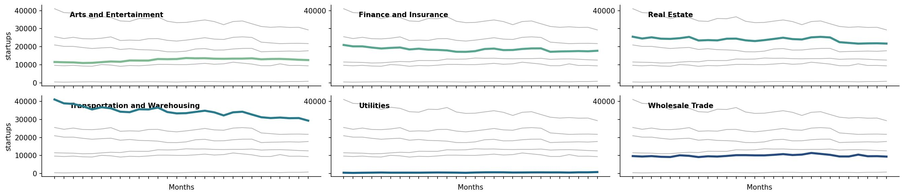
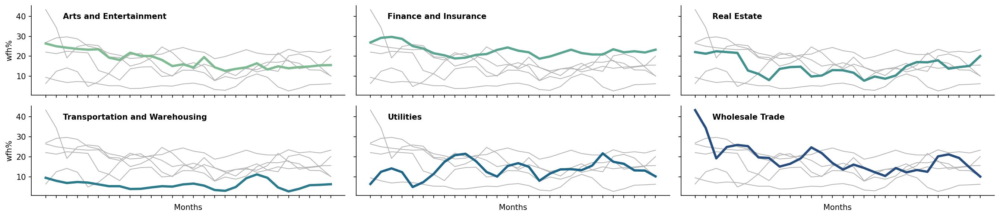
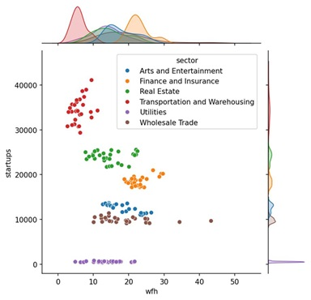
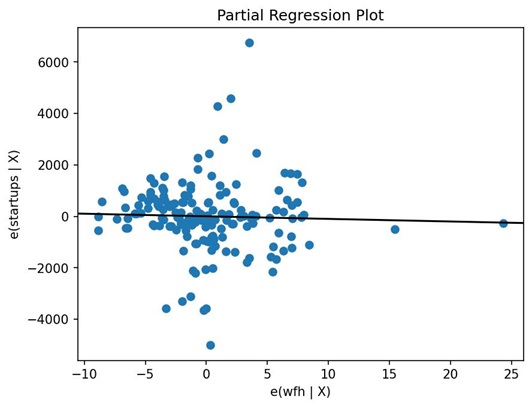
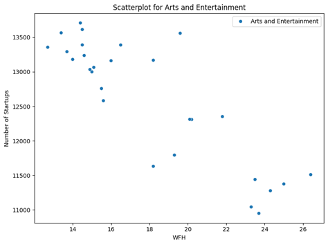
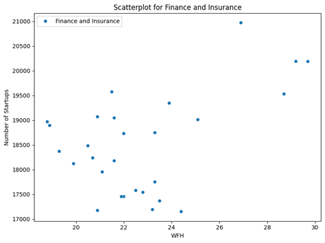
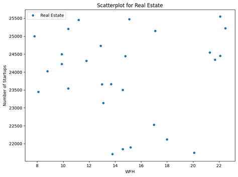
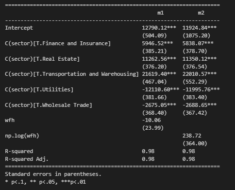

# Welcome to [We Have Startups at Home](https://keith-cheung.github.io/FIN377Final/)

This is a website to showcase our final project for FIN 377.

To see the complete analysis file(s) click [here](https://github.com/Keith-Cheung/FIN377Final/blob/main/build_sample.ipynb).


## Table of contents
1. [Project Summary](#introduction)
2. [Hypothesis](#hyp)
3. [Data Collection](#section2)
4. [Methodology](#meth)
    a. [Figures](#figures)
5. [Interpretation and Discussion](#interpretation)
6. [Conclusion](#conc)

## Project Summary  <a name="introduction"></a>

The "We Have Startups at Home" project aims to explore the relationship between remote work trends and the proliferation of startups. With the rise of remote work culture, especially accelerated by the COVID-19 pandemic, there is a growing interest in understanding how this trend intersects with entrepreneurial activities, particularly in the realm of startups. This report presents the findings of a regression analysis conducted to investigate the potential impact of remote work on startup creation and growth. We are conducting this analysis using work from home data from "WFHResearch.com" as well as startup data from the Bureau of Labor Statistics and United States Census Bureau.

The inspiration for our final project originates from the impact of the COVID-19 pandemic. We want to analyze how the recent shift in work from home (WFH) during and after the pandemic influences the quantity of startups developed. We plan on using prior work on WFH, employee attitude towards WFH, and various lists of startups to help us understand the relationship between the shift in WFH and the quantity of startups created. First, we need to assess the startups on a macro scale. Generally, we are asking the following questions:

1. What drives the creation of startups?
2. Has there been a significant increase in WFH since 2019?

## Hypothesis <a name="hyp"></a>

Our hypothesis is that we believe that there will be a strong correlation between the increase of WFH since 2015 and the amount of startups that have been created. With an increase in WFH flexibility, more people are starting their own businesses. Our goal is to find a relationship that shows a correlation between WFH and the amount of startups created.

## Data Collection <a name="section2"></a>

The data for this project consists of samples ranging from the year 2015 to 2023. In the dataset Survival of private sector establishments by opening year, we first filtered the data to include only startups with 100% survival rate to show how many startups were created that year. We had to ensure that all the datatypes were consistent including the removal of commas. In the dataset WFH 1965-present, we had to convert the date time to a type that can be merged with the startup data. Once the data types were consistent in both datasets, we were able to merge them together to perform regression analysis. Because there were only monthly data after the year 2020, we had to use yearly data to see the effects of the pandemic on startups.

Because we used yearly data, there were not enough samples to make a conclusion on the relationship between the creation of startups and the percentage of individuals working from home. We decided to look at monthly data from after the COVID-19 pandemic to see whether the increase in WFH impacted the development of startups. We specifically looked at various industries to see if there are trends within the industries regarding startups and WFH. The industries we took samples from were: utilities, finance and insurance, wholesale trade, transportation and warehousing, real estate, and arts and entertainment.

While we were loading the data for startups and WFH, we noticed that the shape of the dataframes were different. The industry startup data had separate columns for the year as well as the months (Jan-Dec) and a single column for the sectors. The industry WFH data had one column with the date that included both the month and year and had multiple columns for the different sectors. Below are images that show the differences.

Startup Industry Data:


<br><br>
WFH Industry Data:


<br><br>
The first step for processing the data was to remove columns in the WFH data that were not relevant to WFH. These columns included full onsite and hybrid percentages. For the final dataset, we wanted to have columns for sector, month/year, WFH% and startups created. We removed the individual columns for months in the startup industry data and moved them into rows where the date was set as month/year. We changed the data type of the month/year using datetime python '''startup_fixed['year'] = pd.to_datetime(startup_fixed['year']) startup_fixed['year'] = startup_fixed['year'].dt.strftime('%m/%Y')'''

Once the data types were the same in both datasets, we merged them together on the keys sector and year to have one single dataset.

We had to merge multiple datasets and use information on variables that would useful for identifying the relationship for WFH and startups. We also kept subfolders to keep WFH data and startup data separate during the data cleaning process. We downloaded the raw data and performed eda techniques to identify outliers, missing data, or other unusual data and errors. Then we combined and merged all the data into one dataframe that we used to run regressions and create visualizations. We included multiple visualizations to give us more context to our answers about WFH and the amount of startups created. We are going to use regression across the sample time frame to see if there is a relationship between our variables.

Regression Analysis: We conducted a regression analysis to assess the relationship between remote work and startup creation and utilized appropriate statistical techniques to control for confounding variables. We used Python and Jupyter Lab for all data analysis and visualizations below.

## Methodology <a name="meth"></a>
For our regression model, we want to analyze whether there is a relationship in an increase in the percentage of individuals working from home and the development of startups. Our baseline regression model has the amount of startups created as our y variable and the percentage of WFH as our x variable. We also wanted to analyze how WFH in different industries would be associated with the amount of startups created, so we add sector as a categorical x variable to our model. The below is an example of the code used for the regression:


```python
from statsmodels.iolib.summary2 import summary_col  # Importing summary_col function
# regression model to show the relationship between the WFH share of the workforce and the number of startups created

# Run OLS
m1 = sm.OLS.from_formula('startups ~ wfh + C(sector)', data=merged).fit()
m2 = sm.OLS.from_formula('startups ~ np.log(wfh) + C(sector)', data=merged).fit()  # Use np.log for log transformation

# Print out multiple regression results at once
table = summary_col(results=[m1, m2],
                    float_format='%0.2f',
                    stars=True,
                    model_names=['m1', 'm2'],
                    info_dict=None)  # You can pass additional information here if needed
```
## Figures <a name="figures"></a>




Figure 1 and 2: The time series above shows the trend of startups created and the percentage of WFH after the COVID-19 pandemic



Figure 3: This shows the distribution of startups at different percentages of WFH grouped by different industries



Figure 4: This is a partial regression showing the relationship between startups and WFH





Figure 5: These scatterplots show the individual trends of sectors. Each sector is different where there can be either a positive correlation, negataive correlation or no correlation between WFH and startups



Figure 6: The table shows the different coefficients for each x variable as well as the r2
## Interpretation and Discustion <a name="interpretation"></a>

In order to work with the massive datasets, we had to do a lot of cleaning. Similar to in our midterm project, our work was done in a build sample file and we started with our general US statistics regression. We loaded in a dataset that told us how many startups were started every year from 2015 to 2023 and their survival rates; however, in order to stay relevant to our question we narrowed down our data to be concerned with the year end establishment count and not how many were closed down We then loaded our corresponding WFH dataset and narrowed it down to be in the year range we needed. Though the data set was done with annual results except in 2021 and onward, where because of the COVID pandemic and the increased interest in WFH data, results were taken monthly. In order to make this data match the startup annual data and keep it as a 1 to 1 merge, we would take the average WFH share for the year and use that as our desired statistic in the regression. After making sure our variables were the correct types, we did a 1:1 left merge on year with our WFH and startup, running an OLS regression on the number of establishments opened each year and the WFH share of the workforce to get out R-squared that Keith will go into in the next section

Our industry data, on the other hand, required a lot more cleaning. First, we had a startup data csv file with over 30000 entries, we needed to narrow this down to our desired industries in our desired year ranges (this time 2021-2024 due to data limitations), and keep the rest of the variables constant. Next, we had to manually adjust our WFH data since it was in a form that would make the two datasets nearly impossible to merge. The data remained the same, just reformatted. To get a regression and graph for each industry, we cleaned the data further by making datasets for each industry for both WFH and startup data, finally merging the corresponding datasets together before getting them back into a fixed dataset that was ready to run a regression and make graphs. The important caveats in our data that we want to mention are that this data is based on data from the US, in the industry startup data we kept most variables consistent, including the series of application, the geographical location (the whole of the us), and that they were seasonally adjusted. Also as I previously mentioned the time periods of interest, using averages of years in order to get clean merges, and purely focusing on the number of startups that were conceived in order to stay consistent with our question.

Our initial regression was what prompted us to expand our research to separate industries. This r-squared was .29 which showed us that the short time span and limited data based on what we were able to collect was not enough to draw a valid conclusion. After expanding our research to measure based on industry WFH and startup quantity, we were able to run additional regressions that yielded more conclusive results. We feel that we would've been able to find stronger correlations if we had a greater range of data to work with, which is due to not many datasets on this information being available as well as the fact that the COVID-19 pandemic was only 4 years ago, making it hard to find long-term data on WFH and startups post-pandemic.

We found that some sectors had a stronger correlation between WFH and startups generated, such as Transportation and Warehousing, while others had a very weak correlation, such as Utilities. Overall our data shows only a slight correlation between WFH and startups generated based on the datasets we were able to update.

## Conclusion <a name="conc"></a>

In conclusion, the findings of this analysis suggest that the rise of remote work is intertwined with the proliferation of startups, signaling a fundamental shift in the entrepreneurial landscape. As remote work continues to reshape the way we work and interact, it presents both opportunities and challenges for aspiring entrepreneurs and established businesses alike. Understanding and adapting to these dynamics will be crucial for fostering innovation and economic growth in the digital age.

If we were to expand this research project, we would look into the following areas:

1. Qualitative Research: Conduct interviews or surveys with remote workers and startup founders to gain qualitative insights into their experiences, challenges, and perceptions regarding the relationship between remote work and startup creation. This qualitative data can provide a richer understanding of the mechanisms driving this phenomenon.
2. Geographical Analysis: Explore how the relationship between remote work and startups varies across regions outside the ones we studied here. Investigate whether certain locations, such as urban centers or tech hubs, exhibit stronger correlations between remote work adoption and entrepreneurial activity.
3. Impact of Remote Work Policies: Analyze the impact of specific remote work policies and initiatives implemented by governments or organizations on startup formation and growth. Evaluate how factors like tax incentives, infrastructure investments, and regulatory frameworks influence entrepreneurial ecosystems in the context of remote work.
4. Longitudinal Studies: Conduct longitudinal studies to track changes in remote work patterns and startup dynamics over time (which would need to be done 10-15 years down the line). Analyze how these trends evolve in response to macroeconomic conditions, technological advancements, and societal shifts, providing insights into the long-term sustainability of remote work-driven entrepreneurship.
5. Cross-Cultural Comparison: Compare the relationship between remote work and startups across different cultural contexts and national settings. Investigate how cultural norms, values, and attitudes towards entrepreneurship and remote work shape the entrepreneurial landscape in diverse societies.


## About the team


<br>
Keith is a senior at Lehigh studying Finance.
<br><br><br>

<br>
Josh is a senior at Lehigh studying Finance and PreLaw
<br><br><br>

<br>
Danny is a senior at Lehigh studying Finance and Management. 
## Source Code

Startup development:

- [https://www.bls.gov/bdm/us_age_naics_00_table7.txt](https://www.bls.gov/bdm/us_age_naics_00_table7.txt). (overall startups in the US)
- [https://www.census.gov/econ/bfs/current/index.html](https://www.census.gov/econ/bfs/current/index.html). (startup in different industries)

Work From Home:

- [https://wfhmap.com/](https://wfhmap.com/). (WFH data for both overall WFH and industry)
- [https://www.nber.org/papers/w32363](https://www.nber.org/papers/w32363). (WFH paper)

## Important Notes
We needed more data to make stronger conclusions Results varied by industry, expected to vary globally as well if we were able to get data from outside the U.S.

To view the GitHub repo for this website, click [here](https://github.com/Keith-Cheung/FIN377Final/tree/main?tab=readme-ov-file).
