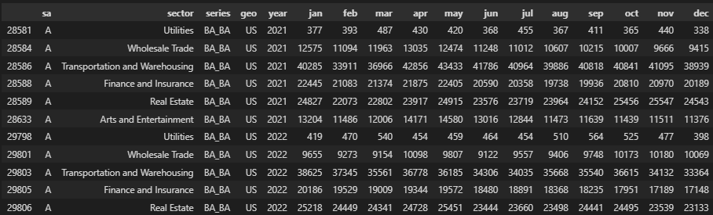
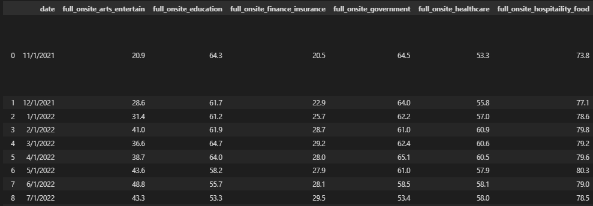

# Welcome to [We Have Startups at Home](https://keith-cheung.github.io/FIN377Final/)

This is a website to showcase our final project for FIN 377.

To see the complete analysis file(s) click [here](https://github.com/Keith-Cheung/FIN377Final/blob/main/build_sample.ipynb).


## Table of contents
1. [Project Summary](#introduction)
2. [Hypothesis](#hyp)
3. [Data Collection](#section2)
4. [Methodology](#meth)
5. [Interpretation and Discussion](#interpretation)
6. [Conclusion](#conc)

## Project Summary  <a name="introduction"></a>

The "We Have Startups at Home" project aims to explore the relationship between remote work trends and the proliferation of startups. With the rise of remote work culture, especially accelerated by the COVID-19 pandemic, there is a growing interest in understanding how this trend intersects with entrepreneurial activities, particularly in the realm of startups. This report presents the findings of a regression analysis conducted to investigate the potential impact of remote work on startup creation and growth. We are conducting this analysis using work from home data from "WFHResearch.com" as well as startup data from the Bureau of Labor Statistics and United States Census Bureau.

The inspiration for our final project originates from the impact of the COVID-19 pandemic. We want to analyze how the recent shift in work from home (WFH) during and after the pandemic influences the quantity of startups developed. We plan on using prior work on WFH, employee attitude towards WFH, and various lists of startups to help us understand the relationship between the shift in WFH and the quantity of startups created. First, we need to assess the startups on a macro scale. Generally, we are asking the following questions:

What drives the creation of startups?
Has there been a significant increase in WFH since 2019?

## Hypothesis <a name="hyp"></a>

Our hypothesis is that we believe that there will be a strong correlation between the increase of WFH since 2015 and the amount of startups that have been created. With an increase in WFH flexibility, more people are starting their own businesses. Our goal is to find a relationship that shows a correlation between WFH and the amount of startups created.

## Data Collection <a name="section2"></a>

The data for this project consists of samples ranging from the year 2015 to 2023. In the dataset Survival of private sector establishments by opening year, we first filtered the data to include only startups with 100% survival rate to show how many startups were created that year. We had to ensure that all the datatypes were consistent including the removal of commas. In the dataset WFH 1965-present, we had to convert the date time to a type that can be merged with the startup data. Once the data types were consistent in both datasets, we were able to merge them together to perform regression analysis. Because there were only monthly data after the year 2020, we had to use yearly data to see the effects of the pandemic on startups.

Because we used yearly data, there were not enough samples to make a conclusion on the relationship between the creation of startups and the percentage of individuals working from home. We decided to look at monthly data from after the COVID-19 pandemic to see whether the increase in WFH impacted the development of startups. We specifically looked at various industries to see if there are trends within the industries regarding startups and WFH. The industries we took samples from were: utilities, finance and insurance, wholesale trade, transportation and warehousing, real estate, and arts and entertainment.

While we were loading the data for startups and WFH, we noticed that the shape of the dataframes were different. The industry startup data had separate columns for the year as well as the months (Jan-Dec) and a single column for the sectors. The industry WFH data had one column with the date that included both the month and year and had multiple columns for the different sectors. Below are images that show the differences.

Startup Industry Data:



WFH Industry Data:



The first step for processing the data was to remove columns in the WFH data that were not relevant to WFH. These columns included full onsite and hybrid percentages. For the final dataset, we wanted to have columns for sector, month/year, WFH% and startups created. We removed the individual columns for months in the startup industry data and moved them into rows where the date was set as month/year. We changed the data type of the month/year using datetime python startup_fixed['year'] = pd.to_datetime(startup_fixed['year']) startup_fixed['year'] = startup_fixed['year'].dt.strftime('%m/%Y')

Once the data types were the same in both datasets, we merged them together on the keys sector and year to have one single dataset.

We had to merge multiple datasets and use information on variables that would useful for identifying the relationship for WFH and startups. We also kept subfolders to keep WFH data and startup data separate during the data cleaning process. We downloaded the raw data and performed eda techniques to identify outliers, missing data, or other unusual data and errors. Then we combined and merged all the data into one dataframe that we used to run regressions and create visualizations. We included multiple visualizations to give us more context to our answers about WFH and the amount of startups created. We are going to use regression across the sample time frame to see if there is a relationship between our variables.

Regression Analysis: We conducted a regression analysis to assess the relationship between remote work and startup creation and utilized appropriate statistical techniques to control for confounding variables. We used Python and Jupyter Lab for all data analysis and visualizations below.

## Methodology <a name="meth"></a>
Blah blah


```python
import seaborn as sns 
iris = sns.load_dataset('iris') 

print(iris.head(),  '\n---')
print(iris.tail(),  '\n---')
print(iris.columns, '\n---')
print("The shape is: ",iris.shape, '\n---')
print("Info:",iris.info(), '\n---') # memory usage, name, dtype, and # of non-null obs (--> # of missing obs) per variable
print(iris.describe(), '\n---') # summary stats, and you can customize the list!
print(iris['species'].value_counts()[:10], '\n---')
print(iris['species'].nunique(), '\n---')
```

Notice that the output does NOT show! **You have to copy in figures and tables from the notebooks.**


## Interpretation and Discustion <a name="interpretation"></a>

Here are some graphs that we created in our analysis. We saved them to the `pics/` subfolder and include them via the usual markdown syntax for pictures.


<br><br>
Some analysis here
<br><br>

<br><br>
More analysis here.
<br><br>

<br><br>
More analysis.

## Conclusion <a name="conc"></a>

Blah blah


## About the team


<br>
Julio is a senior at Lehigh studying finance.
<br><br><br>

<br>
Don is an assistant professor at Lehigh.


## Source Code

## Important Notes

To view the GitHub repo for this website, click [here](https://github.com/donbowen/teamproject).
